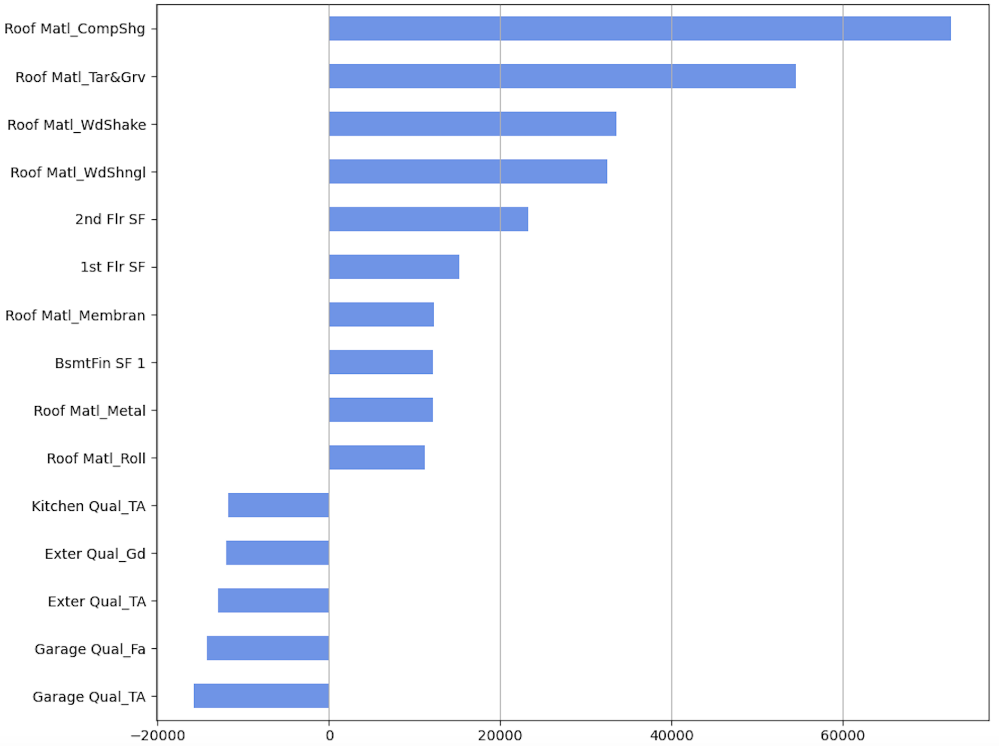
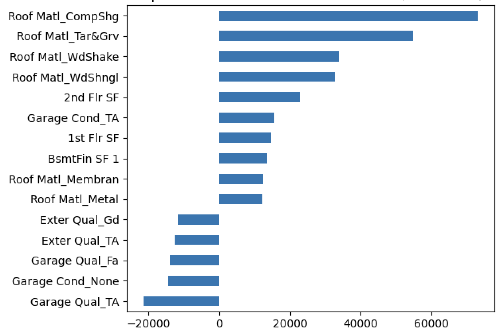

# 🧠 Lasso Coordinate Descent Project

[](https://www.python.org/)
[](https://opensource.org/licenses/MIT)
[](https://jupyter.org/)
[]()

---

## 📌 Description

This repository contains a **practical and theoretical study of Lasso regression** using **coordinate descent**, applied to the well-known **Ames Housing dataset**.  
We compare a **manual implementation** of the coordinate descent algorithm with the **scikit-learn** Lasso model.

---

## 🗂️ Table of Contents

- [📌 Description](#-description)
- [📊 Dataset](#-dataset)
- [🛠️ Files](#️-files)
- [📈 Visualizations](#-visualizations)
- [🚀 How to Run](#-how-to-run)
- [🧠 Author](#-author)

---

## 📊 Dataset

The [Ames Housing Dataset](https://www.kaggle.com/codeinstitute/housing-prices-data) contains detailed information on homes sold in Ames, Iowa (USA).  
We used it to predict house prices based on selected and standardized features.

---

## 🛠️ Files

| Filename                                  | Description |
|-------------------------------------------|-------------|
| `AmesHousing.csv`                         | Dataset used in the analysis |
| `algorithmic method.ipynb`                | Manual coordinate descent implementation |
| `Etude sklearn.ipynb`                     | Scikit-learn Lasso application |
| `Application of Coordinate Descent...pdf` | Final project report (English version) |
| `manual.png`, `sklearn.png`               | Feature importance bar plots |

---

## 📈 Visualizations

### 🔧 Manual Implementation (Top 15 Variables)


### 🤖 Scikit-learn Lasso Output


---

## 🚀 How to Run

1. Clone the repository:
   ```bash
   git clone https://github.com/Mhamedhlt/lasso-coordinate-descent-.git
   cd lasso-coordinate-descent-
   
